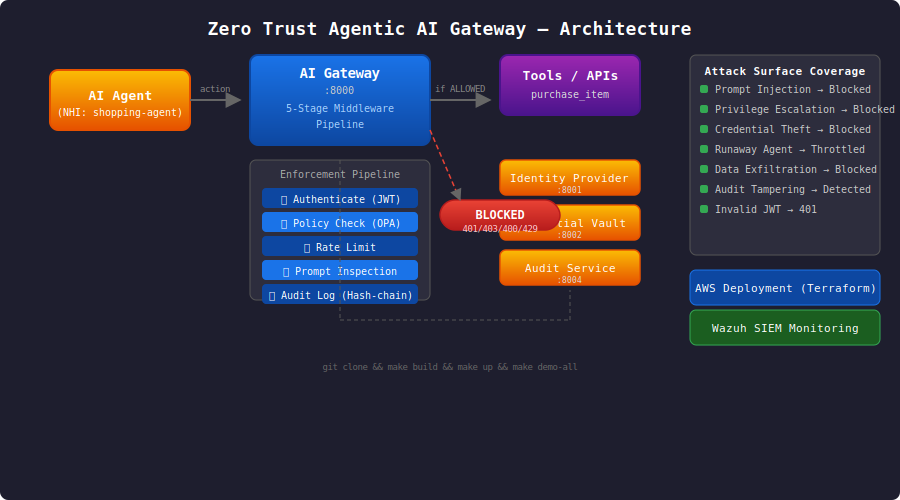

# Zero Trust Agentic AI Gateway


A working reference implementation of Zero Trust security for AI agents. Every agent action is authenticated, authorized, rate-limited, inspected for attacks, and immutably logged — no exceptions.



---

## For Different Audiences

### 👩‍🎓 For Students
Want to learn how Zero Trust applies to AI? Clone this repo:
```bash
git clone https://github.com/Tamerktb/ZT-Agentic-gateway.git
cd ZT-Agentic-gateway
pip install fastapi uvicorn httpx pydantic pydantic-settings PyJWT

# Run all services and tests in one command:
python test_integration.py
```
Each service has a docstring explaining what it does and why. Start with `services/ai-gateway/src/middleware/` to see the 5-stage pipeline.

**What you'll learn:** JWT authentication, policy-as-code, rate limiting, prompt injection detection, blockchain-style audit logging, dynamic secrets, Docker Compose, Terraform, CI/CD.

### 💼 For Employers
This project demonstrates:
- **System architecture** — 6 microservices communicating over HTTP with health checks and dependency ordering
- **Security engineering** — Zero Trust applied to AI agents (prompt injection, exfiltration, privilege escalation, credential theft, runaway agents)
- **Infrastructure-as-Code** — Terraform module for AWS deployment with VPC micro-segmentation
- **CI/CD** — GitHub Actions pipeline runs all 24 integration tests on every push
- **Clean code** — FastAPI, async Python, Pydantic schemas, OPA-style policies, hash-chain audit

**Verified:** All 24 tests pass. Run `python test_integration.py` to confirm.

### 🔧 For Professionals
The architecture is modular and each service can be replaced or extended:
- Swap the Python policy engine for real OPA/Rego runtime
- Replace the in-memory audit store with PostgreSQL or S3
- Add Redis for distributed rate limiting
- Extend attack patterns in `prompt_inspection.py` for your own use case
- Deploy to AWS with `terraform apply`

**One honest note:** The policy engine parses `.rego` files with Python instead of running OPA. It uses the same policy structure but evaluates natively. Swap in `openpolicyagent/opa` for production.

### 🔍 For Recruiters
**Role fit:** SOC Analyst, Security Engineer, Cloud Security, AI Security, DevSecOps

**Keywords:** Python, FastAPI, Zero Trust, JWT, OPA/Rego, Docker, Terraform, AWS, CI/CD, SIEM, Wazuh, Splunk, Threat Detection, Incident Response, Penetration Testing, ISO 27001

**24/24 integration tests pass** — this isn't theory, it's working code.

---

## Quick Start

```bash
# With Docker:
make build && make up
make demo-all

# Without Docker:
python test_integration.py

# View audit chain:
curl http://localhost:8004/api/v1/audit/chain | python -m json.tool

# Check enforcement stats:
curl http://localhost:8000/api/v1/admin/stats | python -m json.tool
```

---

## Demo


### 5 Attack Scenarios Blocked

| Attack | How It's Blocked | HTTP Code |
|--------|-----------------|-----------|
| Invalid JWT | Auth middleware rejects fake/expired tokens | 401 |
| Prompt injection | Regex pattern matching detects "ignore instructions", jailbreaks | 400 |
| Privilege escalation | Policy engine denies tools outside agent's role | 403 |
| Excessive spend | Rate limiter throttles >10 actions/min or >$1000/hr | 429 |
| Data exfiltration | Pattern detection blocks credit cards, passwords, SSNs | 400 |

---

## Services

| Service | Port | Role |
|---------|------|------|
| `ai-gateway` | 8000 | Zero Trust enforcement — 5-stage middleware pipeline |
| `identity-provider` | 8001 | NHI management — JWT issuance and verification |
| `credential-vault` | 8002 | Dynamic per-action credentials with TTL expiry |
| `policy-engine` | 8003 | Rego-style policy rules (parsed in Python) |
| `audit-service` | 8004 | Immutable hash-chain audit log |
| `demo-agents` | — | Shopping agent + sub-agent spawner |
| `attack-simulator` | — | 6 Zero Trust control demonstrations |

---

## Middleware Pipeline

Every agent action passes through 5 stages before reaching any tool:

```
Agent → ① Authenticate (JWT) → ② Policy Check → ③ Rate Limit → ④ Prompt Inspection → ⑤ Audit Log → Tool
```

If any stage fails, the action is blocked immediately and logged.

---

## Project Structure

```
├── .github/workflows/ci.yml       # 24-test CI pipeline
├── docker-compose.yml             # Multi-service orchestration
├── Makefile                        # Build/run/demo commands
├── test_integration.py             # Full integration test suite
├── services/
│   ├── ai-gateway/                # Core Zero Trust enforcement
│   │   └── src/middleware/        # 5-stage pipeline
│   ├── identity-provider/         # NHI management (JWT)
│   ├── credential-vault/          # Dynamic secrets broker
│   ├── policy-engine/             # Rego-style policy rules
│   ├── audit-service/             # Hash-chain audit log
│   ├── demo-agents/               # Example agent flows
│   └── attack-simulator/          # Attack demonstrations
├── terraform/                      # AWS IaC deployment
├── monitoring/                     # Wazuh SIEM rules
└── images/                         # Architecture diagram
```

---

## Verification

```bash
python test_integration.py

RESULTS: 24/24 passed
```

Tests cover: NHI registration, JWT issuance/verification, credential checkout/expiry, policy allow/deny decisions, valid action routing, bad token rejection (401), prompt injection blocking (400), data exfiltration blocking (400), privilege escalation blocking (403), rate limiting (429), kill switch, admin stats, audit chain integrity.

---

## Terraform Deployment (AWS)

```bash
cd terraform
terraform init && terraform apply
```

Provisions: ECS Fargate, VPC with micro-segmentation, Security Groups, CloudTrail, VPC Flow Logs → S3 → Wazuh SIEM, CloudWatch alarms.

---

## Extending

Add a tool policy in `services/policy-engine/policies/tool_policy.rego`:
```python
tool_controls = {
    "my_new_tool": {
        "require_mfa": False,
        "max_amount": 1000,
        "restrict_actions": ["call_tool"],
    },
}
```

Register a new agent:
```bash
curl -X POST http://localhost:8001/api/v1/nhi/register \
  -H "Content-Type: application/json" \
  -d '{"agent_id": "my-agent", "role": "shopping_agent", "policies": ["purchase_item"]}'
```

---

## License

MIT
